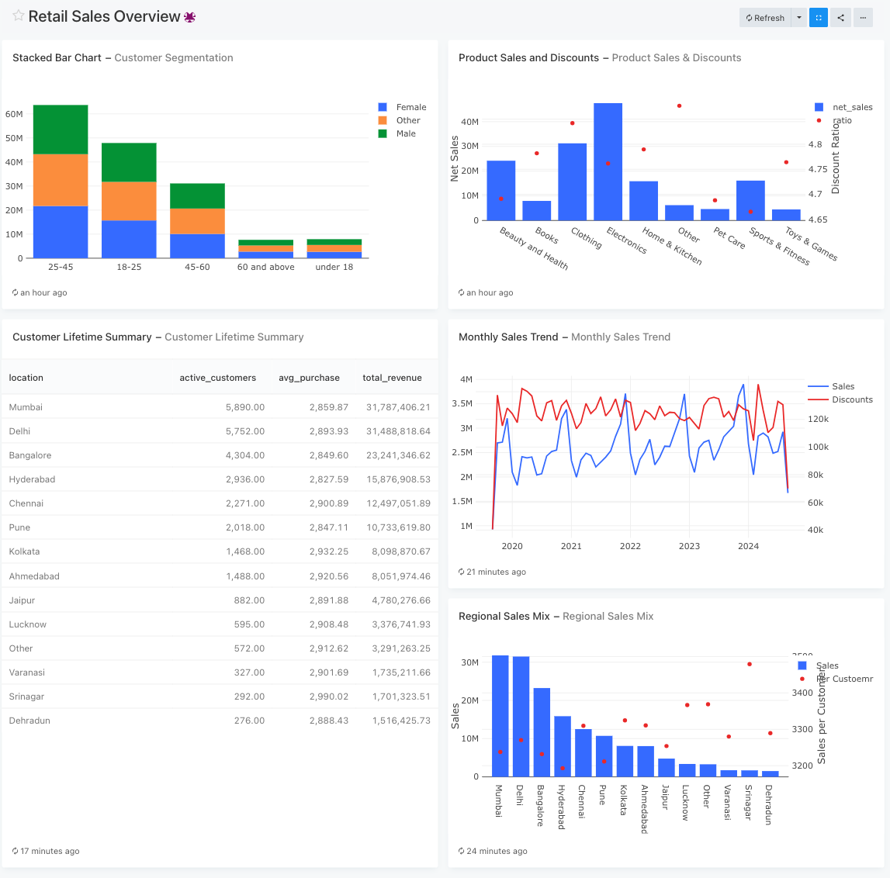

# 🛍️ Retail Sales Demo – Data Analytics Pipeline

This project demonstrates a complete **modern analytics stack** using **DuckDB, SQLite, dbt, and Redash** — all containerized in Docker.  
It models synthetic retail data to explore customer behavior, sales trends, and discount effectiveness.

---

## 🚀 Tech Stack

| Layer | Tool | Purpose |
|-------|------|----------|
| Ingestion | CSV files | Source data for retail transactions |
| Transformation | dbt (CLI) | Build clean dimensional models (`dim_customers`, `fct_sales`, `agg_customer_sales_summary`) |
| Storage | DuckDB + SQLite | Lightweight local analytical databases |
| Visualization | Redash | Dashboarding and SQL-based exploration |
| Orchestration | Docker Compose | Reproducible local environment |

---

## 📊 Data Models

### `dim_customers`
Customer demographic attributes (gender, age group, and location).

### `fct_sales`
Transactional sales facts including gross and net amounts, discounts, and purchase methods.

### `agg_customer_sales_summary`
Aggregated customer-level metrics for sales performance by product, location, and demographic.

---

## 🧠 Key Analyses

1. **Customer Segmentation Overview** – Sales by gender and age group  
2. **Category Performance** – Revenue and discount patterns by product category  
3. **Regional Sales Mix** – Sales distribution by location  
4. **Monthly Sales Trend** – Net sales and discount trends over time  
5. **Customer Lifetime Value** – Average spend and regional customer insights  

---

## 📈 Redash Dashboard



The dashboard combines all five analyses above into a unified retail analytics view,  
including customer segmentation, category performance, and discount effectiveness insights.

---

## 🧰 Getting Started

```bash
# Clone the repository
git clone https://github.com/<your-username>/retail-sales-demo.git
cd retail-sales-demo/redash

# Start Redash and dependencies
docker compose up -d

# Load data into SQLite
python export_to_sqlite.py
